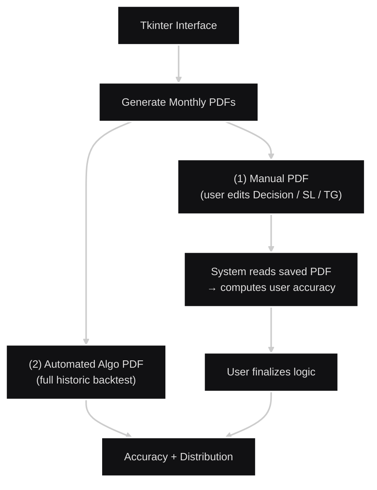

## Backtesting & Reporting Engine – Automated Monthly PDF Generator (T.F.S,Hestrate)
Author: Jnandeep Dev Sarma

Contact: jnandeepdevsarma@gmail.com

# Project Summary

This system generates two separate monthly backtesting PDF reports using a Tkinter interface:

1. Manual Strategy Tester (Interactive PDF)

- A user-editable PDF where traders manually record their decisions.
- The system generates sub-signals (if any) → produces Overview (Long/Short).
- Automatically assigns Decision = CE/PE, which users may override.
- Users fill 1st and 2nd trade fields (entry, SL, TG).
- After completing manual backtesting, the user saves the PDF.
- The software reads this saved PDF and extracts:
- User accuracy %,Target/SL,Win rate
- This module is designed for user-defined manual strategy testing.

2. Automated Algo Tester (Logic-Based PDF)

- After the user finalizes their logic from manual backtesting, the system encodes those rules and performs full automated testing on historical data.

Outputs include:
- Algo accuracy,SL/TG hit,Gain or Loss

This module gives the user a verified, unbiased performance report of their own logic.

# Workflow Overview

## Workflow: PDF Generation & Accuracy



# Folder Contents

```bash
backtesting-engine/
│
├─ README.md                    
├─ 01_Manual_Backtest_Sample.pdf  
├─ 02_Automated_Algo_Sample.pdf   
│
├─ docs/
│   ├─ architecture_diagram.png
│   └─ risk_rules.pdf
│
├─ sample_data/
│   ├─sanitized_automated_algo_sample.csv
│   └─ sanitized_manual_sample.csv
|
├─ code_snippets/
│   ├─ pdf_export_example.py
│   ├─ pdf_readback_example.py
│   └─ requirements.txt
└─ demo/
    ├─ demo_video.mp4
    └─ demo_readme.txt
```

# Column Logic

- Sub-signals (Long/Short)
- Overview → Aggregated signal (Long/Short)
- Decision → Auto CE/PE assigned from Overview
- 1st/2nd Trade → User: SL, TG

PDF → Accuracy Readback
- The software extracts data from the saved PDF fields and computes:
- Hit (TG reached first)
- Miss (SL hit first)
- Accuracy %
- Number of trades

Accuracy is delivered to user.

# How demo works

1. Inspect `01_Manual_Backtest_Sample.pdf` and '02_Automated_Algo_Sample.pdf' to view an example report.
2. To reproduce locally:
 run
```bash
 python code_snippets/pdf_helpers.py 
```
with a Python 3 environment.
3. The demo script uses synthetic/sanitized data and demonstrates how charts, TOC and trade tables are embedded.

# Security / IP

- Production backtesting code and client raw data are proprietary and NOT included.
- Full code and live demos are available under NDA for technical interviews.

# Dependencies

See `code_snippets/requirements.txt` for the demo script dependencies.
